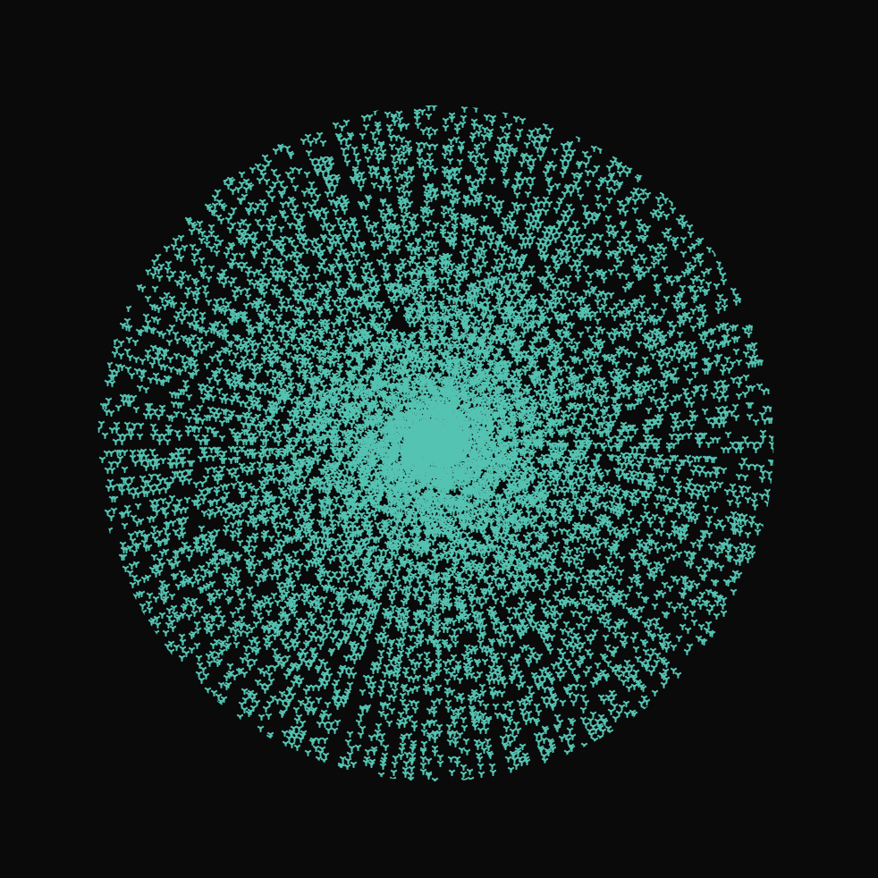
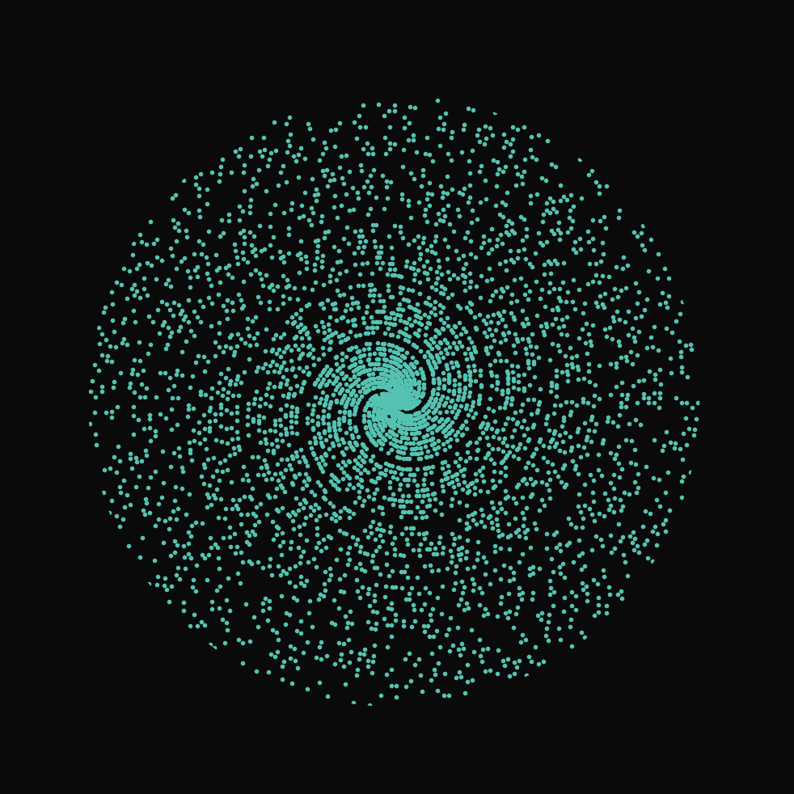
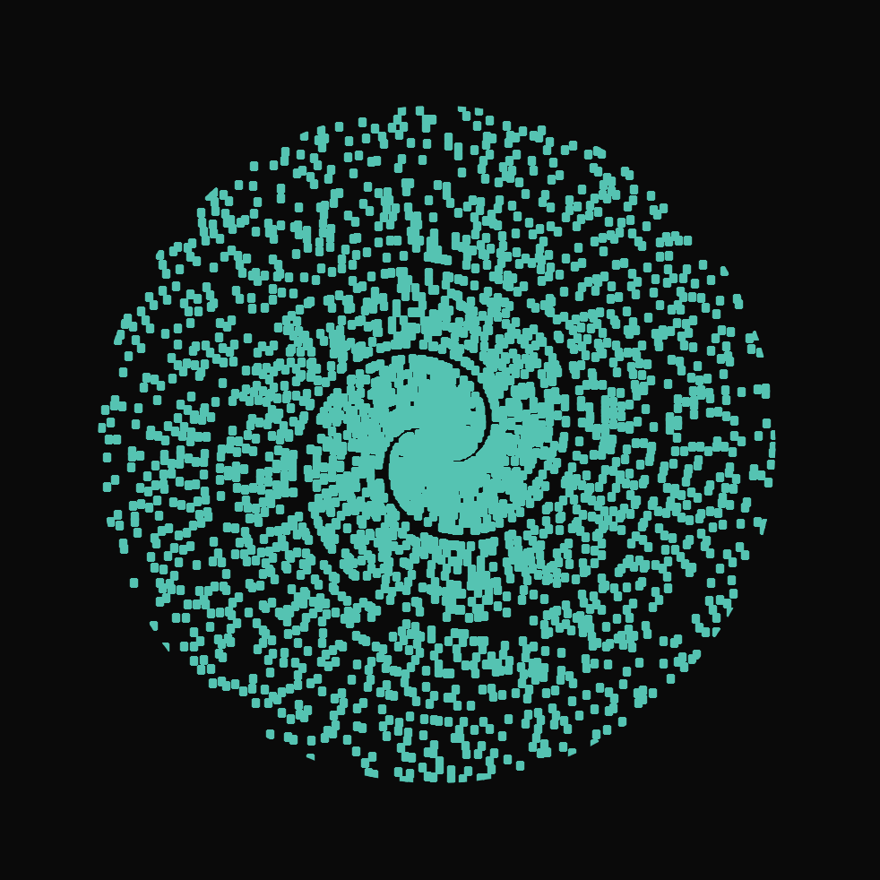

## 3Blue1Brown - Dirichlet’s theorem and pi approximations

I've seen ["Why do prime numbers make these spirals?"](https://www.youtube.com/watch?v=EK32jo7i5LQ) video from 3Blue1Brown and decided to replicate the visual effect of the start of the video.

[](https://youtu.be/EK32jo7i5LQ?si=9gusOxxDDAAWMS07&t=138)

---

### How to run it

To run this code install the requirements:

```$ pip install -r requirements.txt```

and execute:

```$ python main.py```

---

### Previews

**Speeded up!!**

<video width="320" height="240" controls>
  <source src="media/vid.mp4" type="video/mp4">
</video>

<div style="display: flex;">
    
    
    
</div>

---

### Extra

You can change parameters such as colors and the marker at the start of the code.
There are a bunch of optimizations that can be done for this code to be faster, feel free to do so.

Also, the correct marker should be "s", but the plot looks awful with the squared marker, so I let the dot as default.

All of this code was made by myself.